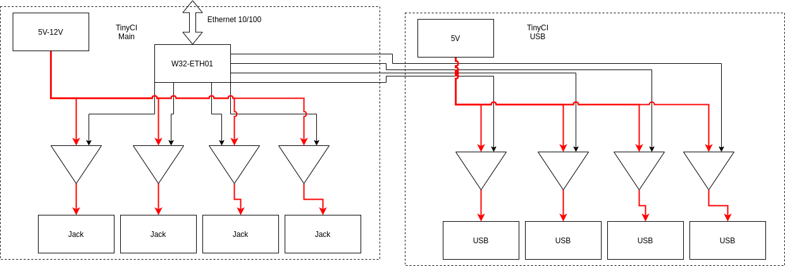
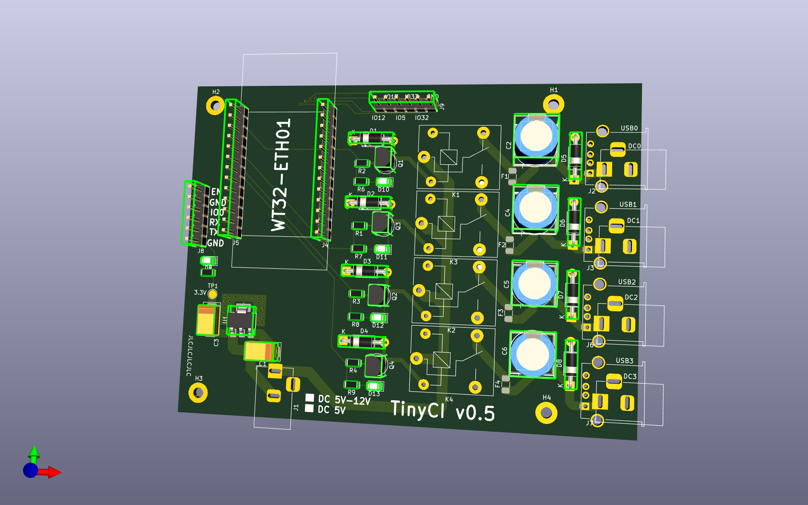
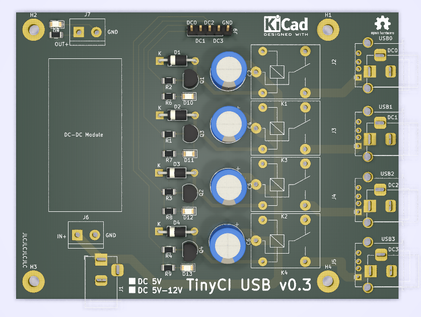
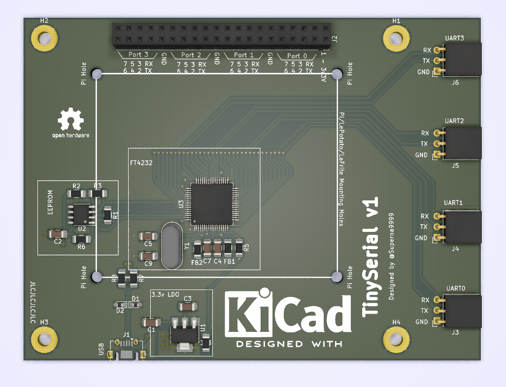

# TinyCI

General Concept:



TinyCi Main
-----------

Relay board controlled by a `W32-ETH01` module.

Input: 5V



Produced:
- v0.5: x5 produced, x4 soldered, x3 used in production
- v0.7: In Production (JLCPCB)

ESP32 Firmware: see `firmware/tinyci-fw/`

Remote Relay Control script: see `firmware/tinyci-fw/tinyci-relay.py`

TinyCi USB
-----------

Secondary Relay board controlled by the `W32-ETH01` on the main board.

Input: 5V to 12V



Produced:
- v0.1: x5 produced, x1 soldered, x0 used in production
- v0.3: In Production (ALLPCB)

TinySerial
-----------

Quad FTDI board + breakout of all FTDI I/Os with the TinyCi form factor + holes
to hook a Pi/LaFrite/LePotato to control the FTDI + TinyCi USBs.

Input: USB



Produced:
- v1: In Production (JLCPCB)

LICENCE
-------

```
CERN OPEN HARDWARE LICENCE v1.1
```
